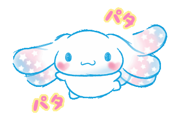

 

&nbsp;&nbsp;

&nbsp;&nbsp;
<strong>Hi, I'm Klaudia - A Full Stack Engineer</strong>
&nbsp;&nbsp;

 
 

 

<h2>Welcome In ૮ ˶ᵔ ᵕ ᵔ˶ ა</h2>

This is my little GitHub corner.

I like making small, useful things and slowly turning ideas into projects. Some are polished, some are experiments, and some are little practice pieces that taught me something important.

Here you will find the projects I want to keep close: my thesis, deployed apps, university work, and tools I made while learning.

I am always enthusiastic to learn more, improve my skills, and build better things step by step. Tiny progress still counts. ᕙ( •̀ ᗜ •́ )ᕗ

<table>
  <tr>
    <td><strong>Currently learning</strong></td>
    <td>web development, devops, security, and cleaner project structure</td>
  </tr>
  <tr>
    <td><strong>Currently making</strong></td>
    <td>fun small tools, resource collections, and practical apps</td>
  </tr>
</table>

 
 

 

<h2>Main Shelf ୨୧</h2>

&nbsp;&nbsp;&nbsp;

My thesis project, and one of the pieces of work I care about most. ( ˶ˆᗜˆ˵ )

<strong>Things I Put Online (*^_^*)</strong>

 

Coding Resources is my cozy learning collection. Llogarit Pagen is a salary calculator I made and deployed with GitHub Pages.

Movie Website is a movie-focused app. Instagram Followers is a project around followers and profile data.

My private cookbook app, deployed with Firebase.

 

<strong>From Uni And Practice (｡•̀ᴗ-)✧</strong>

 

A neural network project using the Bank Marketing UCI dataset, plus a small frontend timing project.

A tiny game project for practicing simple logic.

 

 

<h2>Tech Toolbox ٩(ˊᗜˋ*)و</h2>

 

Technologies I know or I'm learning, practice with, and keep getting better at one project at a time.

 

 

<h2>Stats Corner (๑˃ᴗ˂)ﻭ</h2>

 

 

<h2>Little Note ૮₍ ˶ᵔ ᵕ ᵔ˶ ₎ა</h2>

There are more public repositories on my profile too, so feel free to wander around and support anything you like.

Thanks for visiting my tiny code corner. I am still learning, still building, and still excited for whatever I get to make next.

 

 
 

 
 

